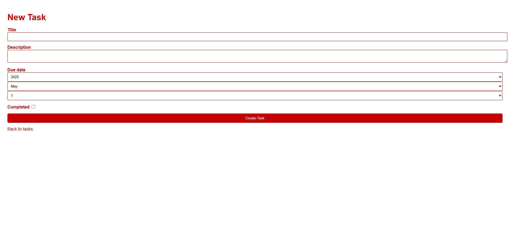

# Simple Task Manager – Ruby on Rails SaaS App

A minimal and clean **To-Do List web application** built with Ruby on Rails as a part of university project, enabling users to manage their personal tasks efficiently.

# Features

- Add a new task with:
  - Title
  - Description
  - Due date
- View a list of all tasks
- Mark tasks as complete/incomplete
- Delete tasks
- Clean and intuitive UI

# How to run it

if you have ruby on rails just open the bash go to the task_management directory and write the next code:
- bundle exec rspec
- bundle exec cucumber
- bundle install
- rails db:create db:migrate
- rails server

after that go to http://localhost:3000

